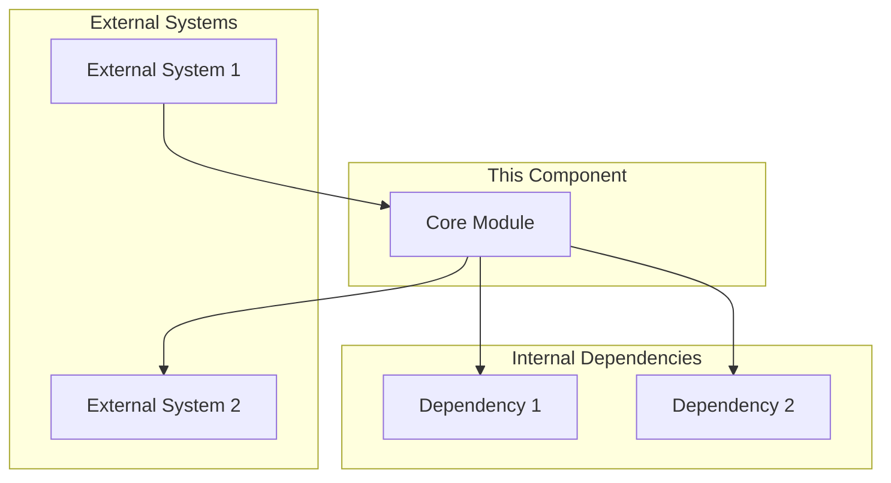
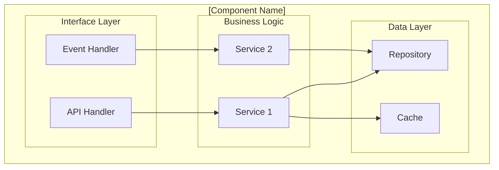
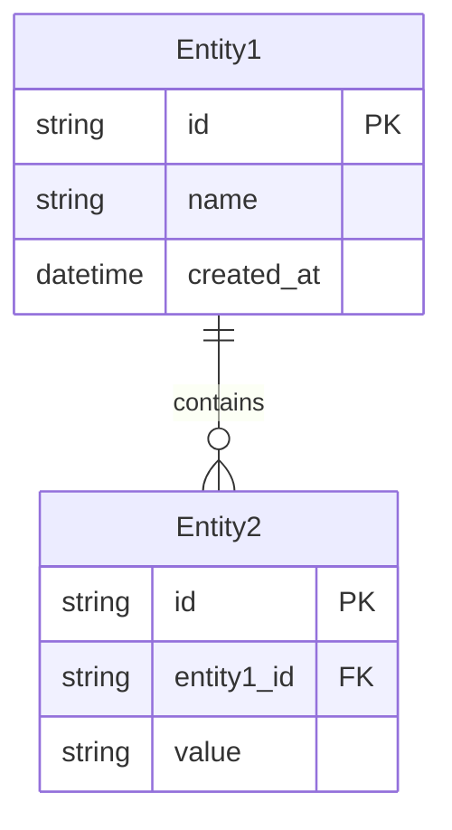
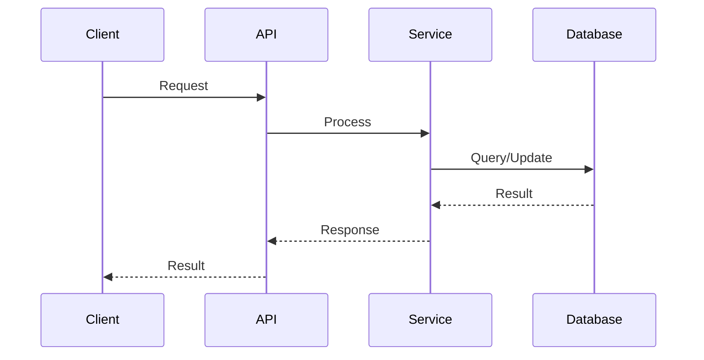

# [Component Name] High Level Design

## 1. Overview

### 1.1 Purpose

[Description of the component's purpose and its role in the overall system.]

### 1.2 Scope

[What this design covers and what it explicitly does not cover.]

### 1.3 Design Goals

- **[Goal 1]**: [Description]
- **[Goal 2]**: [Description]
- **[Goal 3]**: [Description]

## 2. Architecture Overview

### 2.1 Component Context

### 2.2 Component Diagram

## 3. Design Decisions

### 3.1 Key Design Decisions

| Decision | Options Considered | Choice | Rationale |
|----------|-------------------|--------|-----------|
| [Decision 1] | [Options] | [Choice] | [Why] |
| [Decision 2] | [Options] | [Choice] | [Why] |

### 3.2 Trade-offs

| Trade-off | Benefit | Cost |
|-----------|---------|------|
| [Trade-off 1] | [Benefit] | [Cost] |
| [Trade-off 2] | [Benefit] | [Cost] |

## 4. Interfaces

### 4.1 External Interfaces

| Interface | Type | Protocol | Description |
|-----------|------|----------|-------------|
| [Interface 1] | API/Event/File | [Protocol] | [Description] |
| [Interface 2] | [Type] | [Protocol] | [Description] |

### 4.2 Internal Interfaces

| Interface | Consumer | Provider | Contract |
|-----------|----------|----------|----------|
| [Interface 1] | [Consumer] | [Provider] | [Contract ref] |

## 5. Data Design

### 5.1 Data Model Overview

### 5.2 Data Flow

## 6. Non-Functional Considerations

### 6.1 Performance

| Aspect | Requirement | Design Approach |
|--------|-------------|-----------------|
| Response Time | [Requirement] | [Approach] |
| Throughput | [Requirement] | [Approach] |

### 6.2 Scalability

[How the component scales horizontally/vertically]

### 6.3 Security

[Security considerations specific to this component]

### 6.4 Reliability

| Aspect | Approach |
|--------|----------|
| Fault Tolerance | [Approach] |
| Recovery | [Approach] |

## 7. Dependencies

### 7.1 Upstream Dependencies

| Dependency | Version | Purpose | Criticality |
|------------|---------|---------|-------------|
| [Dep 1] | [Version] | [Purpose] | High/Medium/Low |

### 7.2 Downstream Dependencies

| Consumer | Interface | SLA |
|----------|-----------|-----|
| [Consumer 1] | [Interface] | [SLA] |

## 8. Risks and Mitigations

| Risk | Impact | Probability | Mitigation |
|------|--------|-------------|------------|
| [Risk 1] | High/Med/Low | High/Med/Low | [Mitigation] |
| [Risk 2] | [Impact] | [Prob] | [Mitigation] |

## 9. Future Considerations

- [Future consideration 1]
- [Future consideration 2]

---

## Document History

| Version | Date | Author | Changes |
|---------|------|--------|---------|
| v1.0.0 | YYYY-MM-DD | [Author] | Initial version |
