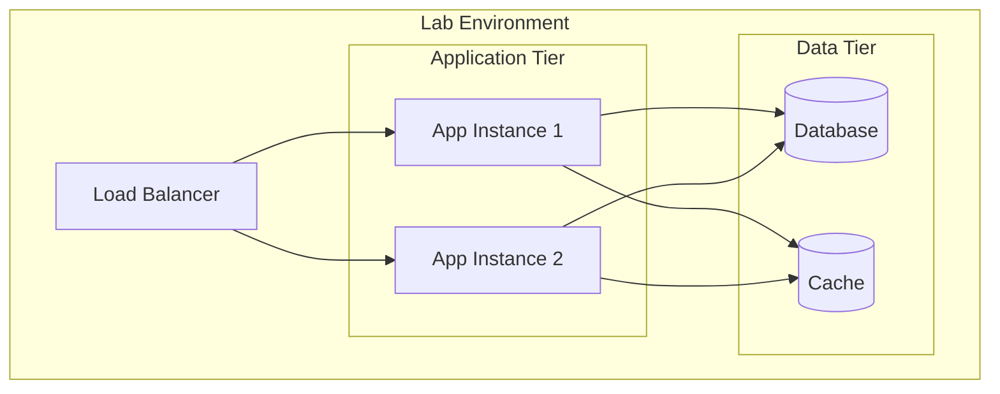

# Lab Environment Specification

## Overview

[Description of the lab/staging environment, its purpose, and relationship to production.]

## Environment Details

| Attribute | Value |
|-----------|-------|
| Environment Name | Lab / Staging |
| Purpose | Integration testing, UAT, pre-production validation |
| Access Level | Development team, QA team |
| Data Classification | Non-production / Anonymized production subset |

## Infrastructure

### Compute Resources

| Component | Instance Type | Count | Specifications |
|-----------|---------------|-------|----------------|
| [Component 1] | [Type] | [N] | [CPU/Mem/Disk] |
| [Component 2] | [Type] | [N] | [CPU/Mem/Disk] |

### Network Configuration

| Network | CIDR | Purpose |
|---------|------|---------|
| [Network 1] | [CIDR] | [Purpose] |
| [Network 2] | [CIDR] | [Purpose] |

### Storage

| Storage Type | Size | Purpose | Backup |
|--------------|------|---------|--------|
| [Type 1] | [Size] | [Purpose] | Yes/No |
| [Type 2] | [Size] | [Purpose] | Yes/No |

## Architecture Diagram



## Services Configuration

| Service | Version | Replicas | Configuration |
|---------|---------|----------|---------------|
| [Service 1] | [Version] | [N] | [Config ref] |
| [Service 2] | [Version] | [N] | [Config ref] |

## External Dependencies

| Dependency | Lab Endpoint | Mock/Real | Notes |
|------------|--------------|-----------|-------|
| [Dep 1] | [URL] | Mock/Real | [Notes] |
| [Dep 2] | [URL] | Mock/Real | [Notes] |

## Data Management

### Test Data

| Data Set | Source | Refresh Frequency | Size |
|----------|--------|-------------------|------|
| [Set 1] | [Source] | [Frequency] | [Size] |
| [Set 2] | [Source] | [Frequency] | [Size] |

### Data Anonymization

- [Anonymization rule 1]
- [Anonymization rule 2]

## Access Control

| Role | Access Level | Approval Required |
|------|--------------|-------------------|
| Developer | Read/Write | No |
| QA | Read/Write | No |
| External | Read Only | Yes |

### Connection Details

```bash
# SSH Access
ssh -i [key-file] [user]@[lab-host]

# Database Access
[db-client] -h [lab-db-host] -u [user] -p

# API Endpoint
https://[lab-api-endpoint]/
```

## Deployment

### Deployment Process

1. [Step 1]
2. [Step 2]
3. [Step 3]

### Rollback Procedure

1. [Rollback step 1]
2. [Rollback step 2]

## Monitoring

| Metric | Dashboard | Alert Threshold |
|--------|-----------|-----------------|
| [Metric 1] | [URL] | [Threshold] |
| [Metric 2] | [URL] | [Threshold] |

## Environment Reset

```bash
# Reset lab environment to clean state
[reset-command]
```

## Differences from Production

| Aspect | Lab | Production |
|--------|-----|------------|
| Scale | [Value] | [Value] |
| Data | Synthetic/Anonymized | Real |
| External Services | Mocked/Sandboxed | Real |

---

## Document History

| Version | Date | Author | Changes |
|---------|------|--------|---------|
| v1.0.0 | YYYY-MM-DD | [Author] | Initial version |
