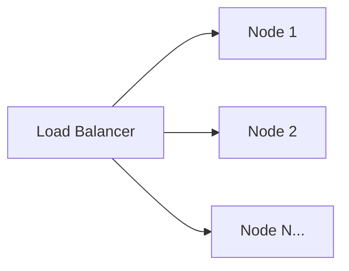

# Engineering Non-Functional Scale Specification

## Overview

[Technical specification for implementing scale requirements defined in product non-functional requirements.]

## Reference Requirements

- Product Scale Requirements: `../../product/scale.md`

## Architecture Scaling Design

### Horizontal Scaling Strategy



| Component | Scaling Method | Min Replicas | Max Replicas | Trigger |
|-----------|----------------|--------------|--------------|---------|
| [Component 1] | [Method] | [Value] | [Value] | [Condition] |
| [Component 2] | [Method] | [Value] | [Value] | [Condition] |

### Vertical Scaling Limits

| Component | Min Resources | Recommended | Max Resources |
|-----------|---------------|-------------|---------------|
| [Component 1] | [CPU/Mem] | [CPU/Mem] | [CPU/Mem] |
| [Component 2] | [CPU/Mem] | [CPU/Mem] | [CPU/Mem] |

## Data Partitioning Strategy

### Sharding Design

| Data Type | Partition Key | Shard Count | Strategy |
|-----------|---------------|-------------|----------|
| [Type 1] | [Key] | [Count] | [Strategy] |
| [Type 2] | [Key] | [Count] | [Strategy] |

### Replication Configuration

| Data Store | Replication Factor | Consistency Level |
|------------|-------------------|-------------------|
| [Store 1] | [Factor] | [Level] |
| [Store 2] | [Factor] | [Level] |

## Caching Strategy

| Cache Layer | Technology | Size | TTL | Eviction Policy |
|-------------|------------|------|-----|-----------------|
| [Layer 1] | [Tech] | [Size] | [TTL] | [Policy] |
| [Layer 2] | [Tech] | [Size] | [TTL] | [Policy] |

## Load Balancing Configuration

| Service | Algorithm | Health Check | Session Affinity |
|---------|-----------|--------------|------------------|
| [Service 1] | [Algo] | [Interval] | Yes/No |
| [Service 2] | [Algo] | [Interval] | Yes/No |

## Auto-Scaling Policies

```yaml
# Example HPA Configuration
apiVersion: autoscaling/v2
kind: HorizontalPodAutoscaler
metadata:
  name: [component-name]
spec:
  minReplicas: [min]
  maxReplicas: [max]
  metrics:
    - type: Resource
      resource:
        name: cpu
        target:
          type: Utilization
          averageUtilization: [value]
```

## Capacity Planning

| Resource | Current | 6 Months | 1 Year | 3 Years |
|----------|---------|----------|--------|---------|
| Compute | [Value] | [Value] | [Value] | [Value] |
| Storage | [Value] | [Value] | [Value] | [Value] |
| Network | [Value] | [Value] | [Value] | [Value] |

## Scale Testing Requirements

- [ ] Load test at 2x expected peak
- [ ] Verify horizontal scaling triggers
- [ ] Validate data rebalancing
- [ ] Test failover during scale operations

---

## Document History

| Version | Date | Author | Changes |
|---------|------|--------|---------|
| v1.0.0 | YYYY-MM-DD | [Author] | Initial version |
