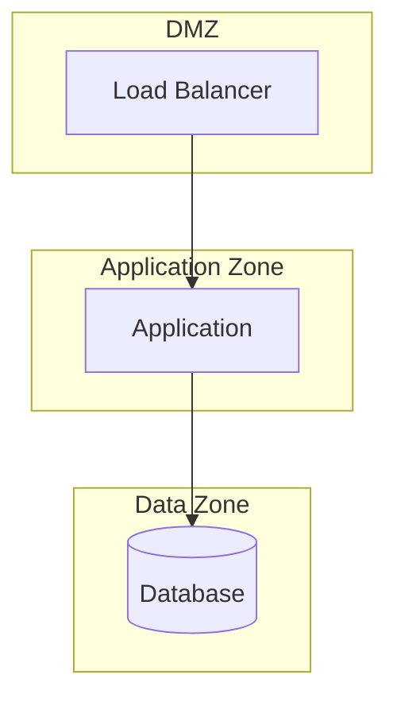

# Engineering Non-Functional Security Specification

## Overview

[Technical specification for implementing security requirements defined in product non-functional requirements.]

## Reference Requirements

- Product Security Requirements: `../../product/security.md`

## Authentication Implementation

### Identity Provider Integration

| Provider | Protocol | Configuration |
|----------|----------|---------------|
| [Provider 1] | OAuth2/OIDC/SAML | [Config details] |
| [Provider 2] | [Protocol] | [Config details] |

### Token Management

| Token Type | Lifetime | Refresh Strategy | Storage |
|------------|----------|------------------|---------|
| Access Token | [Duration] | [Strategy] | [Location] |
| Refresh Token | [Duration] | [Strategy] | [Location] |

### Session Configuration

```yaml
session:
  timeout: [duration]
  max_concurrent: [number]
  invalidation: [strategy]
```

## Authorization Implementation

### RBAC Configuration

```yaml
roles:
  - name: [role-name]
    permissions:
      - resource: [resource]
        actions: [create, read, update, delete]
```

### Policy Enforcement Points

| Component | Enforcement Method | Policy Engine |
|-----------|-------------------|---------------|
| [Component 1] | [Method] | [Engine] |
| [Component 2] | [Method] | [Engine] |

## Encryption Implementation

### At-Rest Encryption

| Data Store | Algorithm | Key Size | Key Rotation |
|------------|-----------|----------|--------------|
| [Store 1] | AES-256 | 256-bit | [Period] |
| [Store 2] | [Algo] | [Size] | [Period] |

### In-Transit Encryption

| Connection | TLS Version | Cipher Suites | Certificate |
|------------|-------------|---------------|-------------|
| [Conn 1] | TLS 1.3 | [Suites] | [Type] |
| [Conn 2] | [Version] | [Suites] | [Type] |

### Key Management

| Key Type | Storage | Rotation | Access Control |
|----------|---------|----------|----------------|
| [Type 1] | [KMS/HSM] | [Period] | [Policy] |
| [Type 2] | [Storage] | [Period] | [Policy] |

## Network Security Implementation

### Firewall Rules

| Source | Destination | Port | Protocol | Action |
|--------|-------------|------|----------|--------|
| [CIDR] | [CIDR] | [Port] | TCP/UDP | Allow/Deny |

### Network Segmentation



## Audit Logging Implementation

### Log Format

```json
{
  "timestamp": "ISO8601",
  "event_type": "[type]",
  "actor": "[user/service]",
  "resource": "[resource]",
  "action": "[action]",
  "result": "success/failure",
  "metadata": {}
}
```

### Log Destinations

| Log Type | Destination | Retention | Access |
|----------|-------------|-----------|--------|
| Security Events | [SIEM] | [Period] | [Role] |
| Audit Logs | [Storage] | [Period] | [Role] |

## Secrets Management

| Secret Type | Storage | Rotation | Injection Method |
|-------------|---------|----------|------------------|
| [Type 1] | [Vault] | [Period] | [Method] |
| [Type 2] | [Storage] | [Period] | [Method] |

## Security Testing Requirements

- [ ] Penetration testing
- [ ] Vulnerability scanning
- [ ] SAST/DAST integration
- [ ] Dependency vulnerability checks

---

## Document History

| Version | Date | Author | Changes |
|---------|------|--------|---------|
| v1.0.0 | YYYY-MM-DD | [Author] | Initial version |
