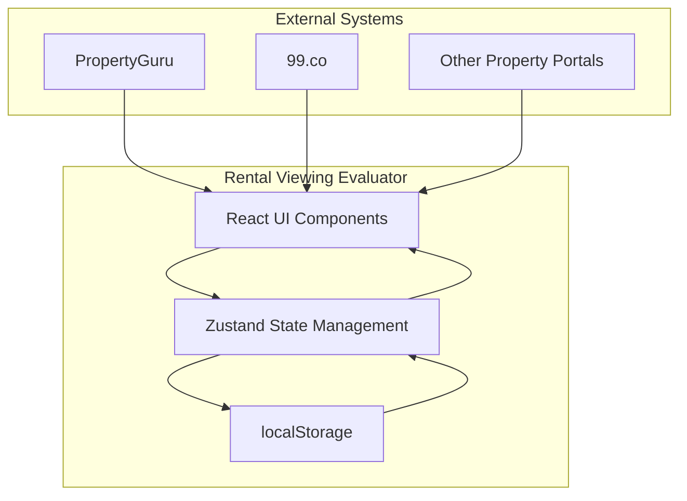
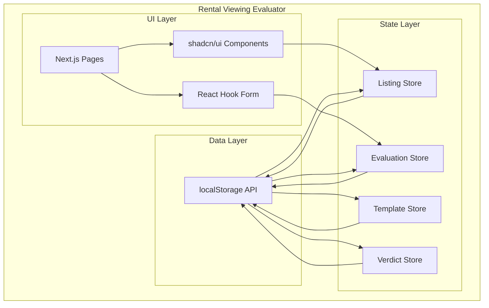
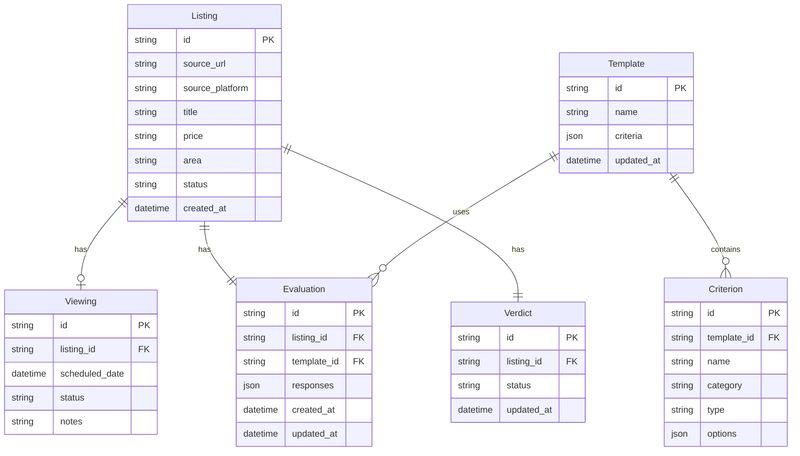
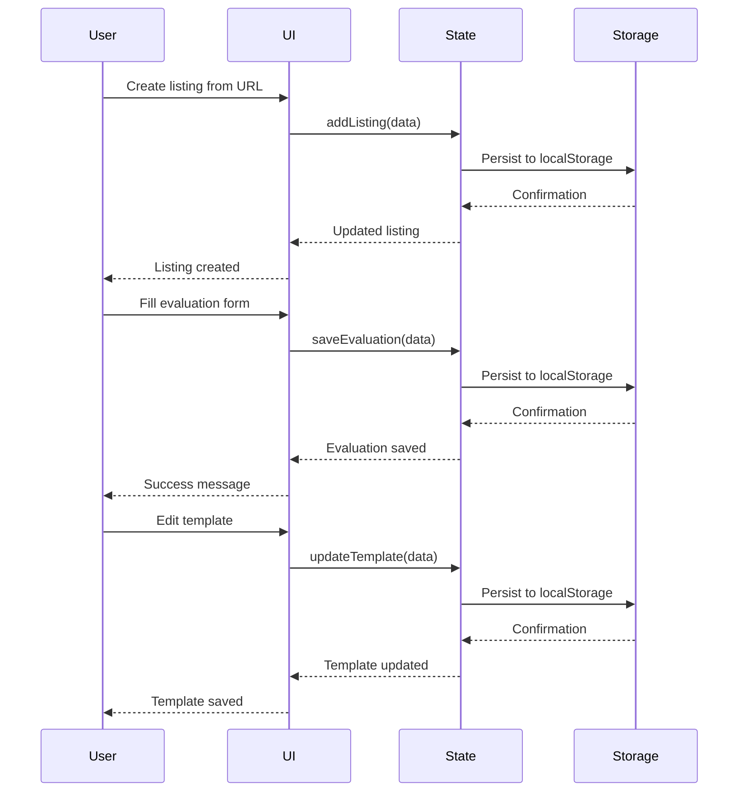

# Rental Viewing Evaluator High Level Design

## 1. Overview

### 1.1 Purpose

The Rental Viewing Evaluator is a client-side web application that provides renters with a structured workspace to evaluate, compare, and make decisions on shortlisted room listings. The application serves as a decision-support layer after users discover listings on external property portals.

### 1.2 Scope

This design covers:
- Client-side web application architecture (no backend server)
- State management using Zustand with localStorage persistence
- Mobile-first responsive UI using Next.js and shadcn/ui
- Core data model for listings, evaluations, templates, and verdicts
- Evaluation template system with customization capabilities

Explicitly out of scope:
- Backend server or API routes
- User authentication or cloud synchronization
- Automated crawling of property portals
- AI-powered recommendation systems
- Multi-user collaboration features

### 1.3 Design Goals

- **Simplicity**: Client-side only architecture to minimize MVP complexity
- **Mobile-First**: Optimized for data entry during viewings on mobile devices
- **Privacy**: All data stored locally in user's browser
- **Extensibility**: Architecture supports future backend integration
- **Performance**: Fast interactions with optimistic UI updates

## 2. Architecture Overview

### 2.1 Component Context

### 2.2 Component Diagram

## 3. Design Decisions

### 3.1 Key Design Decisions

| Decision | Options Considered | Choice | Rationale |
|----------|-------------------|--------|-----------|
| State Management | Redux, Zustand, Context API | Zustand | Lightweight, built-in localStorage middleware, minimal boilerplate |
| Data Persistence | localStorage, IndexedDB, Backend | localStorage | No auth required for MVP, keeps data private, simple implementation |
| Form Library | Formik, React Hook Form, Uncontrolled | React Hook Form | Excellent TypeScript support, minimal re-renders, integrates with shadcn/ui |
| Validation | Yup, Zod, Manual | Zod | TypeScript-first, type inference, seamless React Hook Form integration |
| UI Framework | Material UI, Chakra UI, shadcn/ui | shadcn/ui | Modern, accessible, fully customizable, built on Radix UI |
| Evaluation Attachment | To listing, To viewing, Both | To listing | Simpler data model, one viewing per listing for MVP |
| Template Changes | Migrate data, Keep as-is, Warn on delete | Warn on delete | Protects user data while keeping implementation simple |

### 3.2 Trade-offs

| Trade-off | Benefit | Cost |
|-----------|---------|------|
| Client-side only | No backend complexity, immediate deployment, data privacy | No cloud sync, data loss if browser cache cleared |
| One viewing per listing | Simpler UI and data model | Users cannot track multiple viewings of same room |
| localStorage only | Simple, no setup required | Limited storage (~5MB), no cross-device sync |
| No authentication | Zero friction to start using | Cannot recover data if lost, no collaboration |

## 4. Interfaces

### 4.1 External Interfaces

| Interface | Type | Protocol | Description |
|-----------|------|----------|-------------|
| Property Portal Links | External | HTTPS | Users paste URLs from PropertyGuru, 99.co, etc. to create listings |

### 4.2 Internal Interfaces

| Interface | Consumer | Provider | Contract |
|-----------|----------|----------|----------|
| Listing Store | UI Components | Zustand | CRUD operations for listings |
| Evaluation Store | Evaluation Form | Zustand | Save/load evaluation data |
| Template Store | Template Editor | Zustand | Template CRUD operations |
| Verdict Store | Verdict UI | Zustand | Verdict state management |

## 5. Data Design

### 5.1 Data Model Overview

### 5.2 Data Flow

## 6. Non-Functional Considerations

### 6.1 Performance

| Aspect | Requirement | Design Approach |
|--------|-------------|-----------------|
| Initial Load | < 2 seconds | Next.js automatic code splitting, lazy loading |
| Form Interactions | < 100ms | React Hook Form minimal re-renders, Zustand efficient updates |
| Comparison View | < 500ms | Pre-computed comparison data, memoized components |

### 6.2 Scalability

- **Horizontal**: Not applicable (client-side only)
- **Vertical**: Optimized for typical user with 5-50 listings
- **Storage**: localStorage limited to ~5MB, sufficient for MVP use case

### 6.3 Security

- All data stored locally in user's browser
- No external API calls except property portal links
- No authentication means no attack surface for credential theft
- XSS prevention through React's built-in escaping
- Input validation via Zod schemas

### 6.4 Reliability

| Aspect | Approach |
|--------|----------|
| Fault Tolerance | Graceful degradation if localStorage unavailable |
| Recovery | Export/import functionality for data backup (future enhancement) |
| Data Integrity | Zod validation on all inputs, optimistic UI with rollback |

## 7. Dependencies

### 7.1 Upstream Dependencies

| Dependency | Version | Purpose | Criticality |
|------------|---------|---------|-------------|
| Next.js | ^15.x | React framework, routing | High |
| React | ^19.x | UI library | High |
| TypeScript | ^5.x | Type safety | High |
| Zustand | ^5.x | State management | High |
| React Hook Form | ^7.x | Form handling | High |
| Zod | ^3.x | Validation | High |
| Tailwind CSS | ^3.x | Styling | High |
| shadcn/ui | Latest | UI components | High |
| Lucide React | Latest | Icons | Medium |

### 7.2 Downstream Dependencies

| Consumer | Interface | SLA |
|----------|-----------|-----|
| End Users | Web Browser | Modern browser with localStorage support |

## 8. Risks and Mitigations

| Risk | Impact | Probability | Mitigation |
|------|--------|-------------|------------|
| localStorage quota exceeded | High | Low | Implement storage monitoring, warn user, suggest export |
| Browser clears cache | High | Medium | Add export/import feature, educate users |
| Mobile browser limitations | Medium | Medium | Test on major mobile browsers, progressive enhancement |
| Template data corruption | Medium | Low | Zod validation, backup previous template version |
| Poor mobile UX | High | Medium | Mobile-first design, testing on actual devices |

## 9. Future Considerations

- Add backend API routes for cloud synchronization
- Implement user authentication for multi-device access
- Add export/import functionality for data backup
- Support multiple viewings per listing
- Implement lightweight scoring system
- Add property portal URL parsing for auto-metadata
- Integrate map/commute data
- Add reminder notifications for upcoming viewings

---

## Document History

| Version | Date | Author | Changes |
|---------|------|--------|---------|
| v1.0.0 | 2025-01-07 | Cascade | Initial version |
