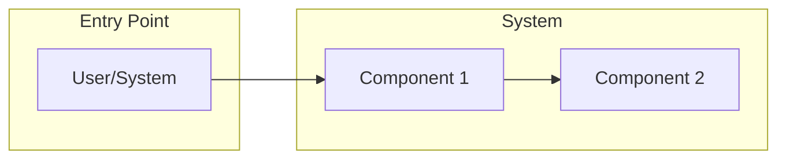
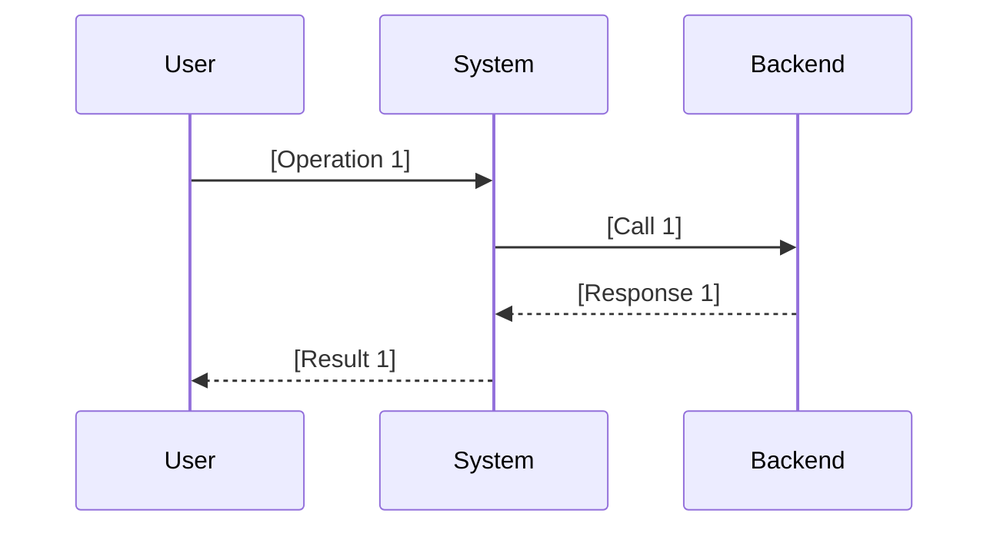

# Feature Specification: [Feature Name]

> Note: This document is the feature specification for [Feature Name]. For architecture design, see `../../architecture/components/[path]/design.md`.

---

## Table of Contents

- [Part 1: Feature Overview](#part-1-feature-overview)
- [Part 2: Core Specifications](#part-2-core-specifications)
- [Part 3: System Interactions](#part-3-system-interactions)
- [Part 4: Data Model](#part-4-data-model)
- [Part 5: API Design](#part-5-api-design)
- [Part 6: Operations & Quality](#part-6-operations--quality)

---

# Part 1: Feature Overview

## Overview

[Overall description of the feature, explaining its purpose and value.]

## Responsibilities

- **[Responsibility 1]**: [Responsibility 1 description]
- **[Responsibility 2]**: [Responsibility 2 description]
- **[Responsibility 3]**: [Responsibility 3 description]

## Non-Goals

- [Non-goal 1]
- [Non-goal 2]
- [Non-goal 3]

## User Stories & Rationale

> User stories capture *why* this feature exists — the concrete scenarios a user encounters that this feature addresses. Each story is written as:
> **"As a [persona], I want to [action], so that [outcome/value]."**
> If the feature was born from a specific design decision or trade-off, capture that under "Design Rationale."

### User Stories

- **[Persona]**: As a **[persona]**, I want to **[action]**, so that **[outcome/value]**.
- **[Persona]**: As a **[persona]**, I want to **[action]**, so that **[outcome/value]**.

### Design Rationale

[Explain why this feature was built this way, what alternatives were considered, and what trade-offs were accepted. This prevents future contributors from questioning decisions without understanding the context.]

---

# Part 2: Core Specifications

## 2.1 [Core Concept 1]

[Detailed description of core concept 1]

| Attribute | Description |
|-----------|-------------|
| **[Attribute 1]** | [Description] |
| **[Attribute 2]** | [Description] |

## 2.2 [Core Concept 2]

### [Sub-concept]

| Type | Description | Example |
|------|-------------|---------|
| **[Type 1]** | [Description] | [Example] |
| **[Type 2]** | [Description] | [Example] |

## 2.3 Schema Definition

```yaml
# [Configuration file name]
spec:
  field1: string        # [Field 1 description]
  field2: string        # [Field 2 description]
  items:                # [List description]
    - id: string        # [ID description]
      name: string      # [Name description]
```

## 2.4 Complete Example

```yaml
spec:
  field1: "example-value"
  field2: "example-value"
  items:
    - id: "item-1"
      name: "Item One"
```

---

# Part 3: System Interactions

## 3.1 Interaction Model



## 3.2 Sequence Diagram



---

# Part 4: Data Model

## 4.1 CRD Overview

| CRD | Description |
|-----|-------------|
| `[CRD1]` | [CRD1 description] |
| `[CRD2]` | [CRD2 description] |

## 4.2 Field Definitions

### [Resource Name].spec

| Field | Type | Required | Description |
|-------|------|----------|-------------|
| `field1` | string | Yes | [Field 1 description] |
| `field2` | string | No | [Field 2 description] |

### [Resource Name].status

| Field | Type | Description |
|-------|------|-------------|
| `state` | string | [State description] |
| `conditions` | []Condition | [Conditions description] |

---

# Part 5: API Design

## 5.1 API Overview

| Method | Path | Description |
|--------|------|-------------|
| GET | `/api/v1/[resource]` | [Get resource] |
| POST | `/api/v1/[resource]` | [Create resource] |
| PUT | `/api/v1/[resource]/{id}` | [Update resource] |
| DELETE | `/api/v1/[resource]/{id}` | [Delete resource] |

## 5.2 Request/Response Examples

### GET /api/v1/[resource]

**Response:**
```json
{
  "items": [
    {
      "id": "example-id",
      "name": "Example Name"
    }
  ]
}
```

---

# Part 6: Operations & Quality

## 6.1 Monitoring Metrics

| Metric | Description | Threshold |
|--------|-------------|-----------|
| [Metric 1] | [Description] | [Threshold] |
| [Metric 2] | [Description] | [Threshold] |

## 6.2 Alert Rules

| Alert | Condition | Severity |
|-------|-----------|----------|
| [Alert 1] | [Condition] | Critical |
| [Alert 2] | [Condition] | Warning |

## 6.3 Logging Standards

| Log Level | Scenario |
|-----------|----------|
| INFO | [Normal operations] |
| WARN | [Abnormal but recoverable] |
| ERROR | [Errors requiring attention] |

---

## Document History

| Version | Date | Author | Changes |
|---------|------|--------|---------|
| v1.0.0 | YYYY-MM-DD | [Author] | Initial version |
